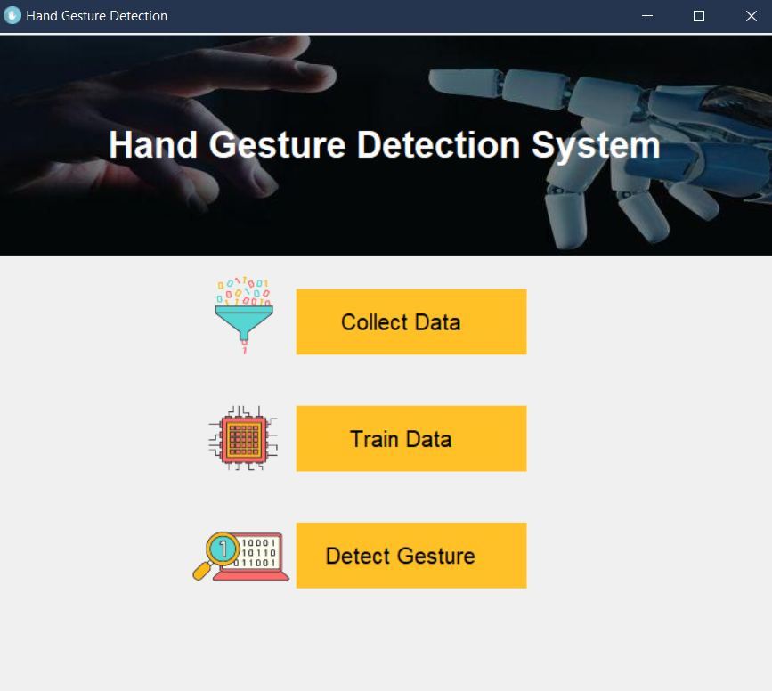

# Hand Gesture Detection and Classification using Convolutional Neural Networks and OpenCV
 
## Description: The primary goal of the project is to create a system that can identify human generated gestures and use this information for machine control.

### INTRODUCTION:
- As computer technology continues to develop, people have smaller and smaller electronic devices.
- Increasingly we are recognizing the importance of human computing interaction (HCI), and particular vision-based gesture and object recognition.
- Gestures used for communication between people and machines too.
- Building natural interaction between human and computer required accurate hand gesture recognition system as an interface for easily human computer interaction (HCI).
- Gestures can be static (posture) or dynamic (sequence of postures).
- The visual based human computer interaction is probably the most widespread area in HCI research.

#### Basic architecture of the system:
The basic architecture for the system is shown: 

### Snapshots:
The snapshots of results are :

Fig.: Interface of the system

Fig. Collect data frame

#### Result:

### CONCLUSION:
- Hand recognition system can be useful in many fields like robotics, computer human interaction, etc
- This project presented a technique to find the number of fingers present in the hand gesture. 
- The primary goal of the project is to create a system that can identify human generated gestures and use this information for machine control and in future can be extended to the more general scenario like appliance control. 
- The proposed hand recognition system is very useful as it can be used as human-computer interface as well as can help paralyzed people. In future devices can be easily controlled through the hand gesture movement easily.

